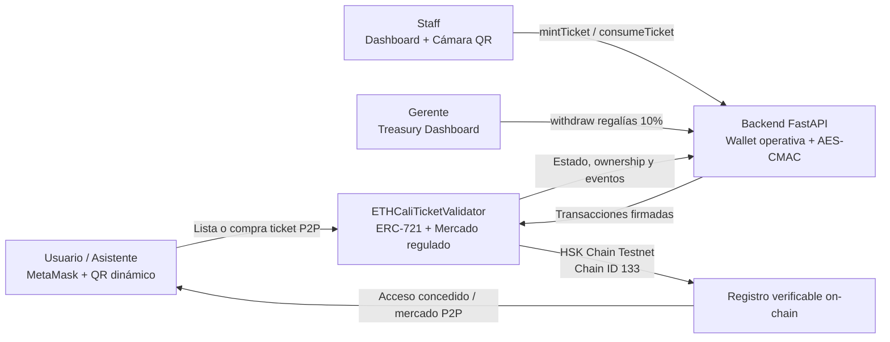

# VeriPass - Smart Ticket Validator & P2P Marketplace

VeriPass convierte la entrada a eventos en una experiencia verificable, antifraude y preparada para el mundo real. Combina tickets Soulbound, QRs dinámicos y un mercado secundario P2P regulado para que asistentes, staff y gerentes compartan un sistema de confianza respaldado por Ethereum.

## Tracks del Hackathon

VeriPass participa explícitamente en:

- **Track 6: Real-World Ethereum Applications**
- **HSK Chain Track**

## El Problema vs La Solución

Los códigos QR tradicionales se fotocopian en segundos. Además, los tickets legítimos se revenden a precios inflados mediante scalping, dejando al asistente sin una forma confiable de demostrar autenticidad o evitar la reutilización.

VeriPass resuelve ambos problemas con una capa de propiedad y validación on-chain:

- **Tickets Soulbound:** los tickets ERC-721 no pueden transferirse libremente ni moverse mediante aprobaciones tradicionales.
- **QRs dinámicos:** cada pase incluye el Token ID y un `timestamp` generado en el momento, y el staff puede leerlo con la cámara del dispositivo.
- **Consumo de un solo uso:** el backend del staff consulta y marca el ticket como consumido en HSK Chain Testnet.
- **Mercado P2P regulado:** el propietario puede listar y vender dentro del contrato; cada reventa distribuye automáticamente el 90% al vendedor y conserva un 10% de regalía segura para el Gerente del evento.

El resultado es una entrada difícil de falsificar, imposible de reutilizar después del consumo y con una reventa transparente en lugar de un mercado secundario opaco.

## UX / UI Avanzada

La interfaz de VeriPass está diseñada para operar bajo presión en una puerta de evento:

- **Ley de Fitts:** inputs y acciones principales son grandes, táctiles y de ancho completo en móvil para reducir errores de operación.
- **Ley de Hick-Hyman:** la complejidad se reduce mediante tres perfiles separados y visibles: **Staff**, **Gerente** y **Usuario**.
- **Dashboard de tres perfiles:** Staff emite y valida; Gerente retira regalías; Usuario conecta MetaMask, lista y compra tickets P2P.
- **Feedback inmediato:** los estados de éxito, error, acceso concedido y ticket usado utilizan mensajes grandes y colores consistentes.
- **QR-first en la puerta:** el escaneo por cámara es el flujo principal y el Token ID manual permanece como Plan B.

## Abstracción de Gas

El asistente no necesita instalar una wallet ni tener HSK para entrar al evento. El Staff Dashboard se comunica con FastAPI, y el backend de Python actúa como wallet operativa custodiada para firmar `mintTicket` y `consumeTicket`, pagando el gas de las operaciones de emisión y validación.

En el mercado P2P, el control vuelve al usuario: la pestaña Usuario conecta MetaMask directamente a HSK Chain Testnet. El usuario firma sus propias operaciones `listTicket` y `buyTicket`, y paga el gas de su actividad de mercado con su propia wallet.

## Arquitectura



## Datos del Despliegue

Contrato verificado en **HSK Chain Testnet**:

```text
0xd57359dDD6fAf3792a37de9483c494Eb2B315833
```

```text
RPC: https://testnet.hsk.xyz
Chain ID: 133
```

El contrato usa OpenZeppelin `ERC721`, `Ownable` y `ReentrancyGuard`. Sus operaciones principales son `mintTicket`, `consumeTicket`, `listTicket`, `buyTicket` y `withdraw`.

## Instalación Rápida

Clona el repositorio y entra al proyecto:

```bash
git clone <URL_DEL_REPOSITORIO>
cd validador-ethcali
```

Configura el backend Python:

```bash
python3 -m venv .venv
source .venv/bin/activate
pip install -r backend/requirements.txt
```

Crea `.env` con la wallet operativa y el contrato desplegado:

```env
PRIVATE_KEY=0xYOUR_PRIVATE_KEY
RPC_URL=https://testnet.hsk.xyz
CONTRACT_ADDRESS=0xd57359dDD6fAf3792a37de9483c494Eb2B315833
```

Levanta VeriPass:

```bash
source .venv/bin/activate
uvicorn backend.main:app --host 0.0.0.0 --port 8000
```

Abre el dashboard en `http://localhost:8000`.

## Foundry: Compilar y Desplegar

Instala las dependencias Solidity y compila:

```bash
source /home/samuel/.bashrc
forge install OpenZeppelin/openzeppelin-contracts --no-git
forge install foundry-rs/forge-std --no-git
forge build
forge test
```

Para desplegar en HSK Chain Testnet:

```bash
set -a
source .env
set +a
forge script script/Deploy.s.sol:Deploy \
    --rpc-url "$RPC_URL" \
    --chain-id 133 \
    --broadcast
```

Mantén `PRIVATE_KEY` fuera del repositorio y utiliza una cuenta operativa o multisig para entornos reales.
